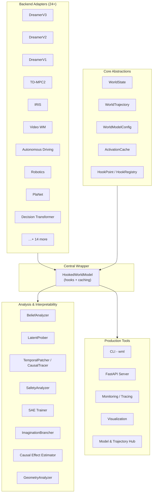

# WorldModelLens — Codebase Walkthrough

## What is WorldModelLens?

**WorldModelLens** is a Python library for **observability, replay, and interpretability of world models** — the internal simulation models used by AI agents to predict what happens next. Think of it as "DevTools for world models": you can inspect every internal activation, replay trajectories with interventions, run safety audits, and probe what concepts the model has learned.

> **Inspired by [TransformerLens](https://github.com/neelnanda-io/TransformerLens)** (Neel Nanda's interpretability toolkit for language models), but adapted for the much broader family of **world models** used in RL, video prediction, robotics, and autonomous driving.

- **Author**: Bhavith Chandra Challagundla
- **Version**: 0.2.0
- **License**: MIT
- **Python**: ≥3.10
- **Key deps**: PyTorch, NumPy, SciPy, scikit-learn, einops, Gymnasium

---

## Architecture Overview



---

## Directory Map

| Directory | Role | Key Files |
|-----------|------|-----------|
| `core/` | Core data types & infrastructure | [latent_state.py](file:///d:/WorldModelLens/core/latent_state.py), [latent_trajectory.py](file:///d:/WorldModelLens/core/latent_trajectory.py), [config.py](file:///d:/WorldModelLens/core/config.py), [hooks.py](file:///d:/WorldModelLens/core/hooks.py), [activation_cache.py](file:///d:/WorldModelLens/core/activation_cache.py) |
| `world_model_lens/` | **Main package** (pip-installable) | [__init__.py](file:///d:/WorldModelLens/sae/__init__.py), [hooked_world_model.py](file:///d:/WorldModelLens/hooked_world_model.py) |
| `world_model_lens/backends/` | 24 model adapters | `base_adapter.py`, `dreamerv3.py`, `iris.py`, `tdmpc2.py`, `video_world_model.py`, etc. |
| `world_model_lens/analysis/` | 14 analysis modules | `belief_analyzer.py`, `ood_detection.py`, `hallucination.py`, `disentanglement.py`, `uncertainty.py`, etc. |
| `world_model_lens/patching/` | Activation patching & causal tracing | `patcher.py`, `causal_tracer.py`, `dim_patcher.py`, `sweep_result.py` |
| `world_model_lens/probing/` | Linear probing & geometry | `prober.py`, `geometry.py`, `layer_prober.py`, `temporal_memory.py` |
| `world_model_lens/sae/` | Sparse Autoencoders | `sae.py`, `trainer.py`, `evaluator.py` |
| `world_model_lens/safety/` | Safety auditing & robustness | `analyzer.py`, `robustness.py` |
| `world_model_lens/branching/` | Imagination branching & counterfactuals | `brancher.py`, `counterfactual.py`, `replay.py` |
| `world_model_lens/causal/` | Causal effect estimation | `effect_estimator.py`, `trajectory_attribution.py`, `counterfactual.py` |
| `world_model_lens/visualization/` | Plotly-based visualizations | `latent_plots.py`, `prediction_plots.py`, `intervention_plots.py`, `temporal_maps.py` |
| `world_model_lens/hub/` | HuggingFace model/trajectory sharing | `model_hub.py`, `trajectory_hub.py` |
| `world_model_lens/envs/` | Gymnasium integration | `env_interface.py`, `gymnasium_hooks.py` |
| `world_model_lens/advanced/` | Advanced MI techniques | `interpretability.py` |
| `world_model_lens/cli/` | CLI commands | `commands.py` |
| `world_model_lens/monitoring/` | Prometheus / OpenTelemetry | — |
| `world_model_lens/experiment/` | W&B experiment tracking | `wandb_integration.py` |
| `world_model_lens/collaboration/` | Serialization, HF hub, tracking | `serialization.py`, `huggingface_hub.py`, `tracking.py` |
| `world_model_lens/scalability/` | Parallel processing | `parallel.py` |
| `world_model_lens/deployment/` | Deployment API & demo | `api.py`, `demo.py` |
| `backends/` (top-level) | Alternate/extended adapters | `dreamerv3.py`, `dreamerv2.py`, `iris.py`, `tdmpc2.py`, `registry.py`, `base.py` |
| `examples/` | 9 runnable example scripts | `01_quickstart.py` → `09_toy_scientific_dynamics.py` |
| `tests/` | 11 test files | `test_smoke.py`, `test_integration_non_rl.py`, `test_safety_analyzer.py`, etc. |
| `notebooks/` | Jupyter notebooks | — |
| `docs/` | Documentation | — |

---

## Core Concepts (the "data model")

### 1. `WorldModelConfig` → [config.py](file:///d:/WorldModelLens/core/config.py)

The single source of truth for architecture hyperparameters:

| Field | Purpose |
|-------|---------|
| `d_h` | Recurrent hidden state dimension |
| `d_action` | Action space size |
| `d_obs` | Observation dimension |
| `n_cat × n_cls` | Categorical latent shape (default 32×32) |
| `backend` | Model family: `dreamer`, `tdmpc`, `rssm`, `custom` |

Derived: `d_z = n_cat * n_cls`, `d_latent = d_h + d_z`. Serializes to/from YAML.

### 2. `LatentState` → [latent_state.py](file:///d:/WorldModelLens/core/latent_state.py)

A single time-step snapshot:

- `h_t` — deterministic recurrent state
- `z_posterior` / `z_prior` — stochastic categorical latents (posterior from obs, prior from dynamics)
- **Optional RL fields**: `action`, `reward_pred`, `reward_real`, `value_pred`, `actor_logits`
- Properties: `.flat` (concatenated feature vector), `.kl` (KL divergence = surprise)

### 3. `WorldTrajectory` → [latent_trajectory.py](file:///d:/WorldModelLens/core/latent_trajectory.py)

A sequence of `WorldState` objects — the fundamental unit for replay, analysis, and branching. Tracks source (`"real"` vs `"imagined"`) and fork points.

### 4. `ActivationCache` → [activation_cache.py](file:///d:/WorldModelLens/core/activation_cache.py)

Dictionary-like storage indexed by `(component_name, timestep)`. Stores every intermediate activation during a forward pass. **New**: Supports storing full `torch.distributions.Distribution` objects for uncertainty analysis.

```python
cache["h", 5]          # hidden state at t=5
cache["z_posterior", 5] # latent posterior at t=5
cache["kl", 5]         # KL divergence at t=5

# New: Store distributions for variance analysis
import torch.distributions as dist
cache["z_posterior", 5] = dist.Normal(mean, std)
params = cache.get_distribution_params("z_posterior", 5)  # {"mean": ..., "std": ..., "variance": ...}
```

### 5. `HookPoint` / `HookRegistry` → [hooks.py](file:///d:/WorldModelLens/core/hooks.py)

TransformerLens-inspired hook system: register callbacks that fire after specific activations are computed. Used for patching, intervention, and custom analysis.

---

## The Central Wrapper: `HookedWorldModel`

[hooked_world_model.py](file:///d:/WorldModelLens/world_model_lens/hooked_world_model.py)

This is the **main entry point** for all analysis. It wraps any backend adapter and provides:

| Method | Purpose |
|--------|---------|
| `run_with_cache(obs, actions)` | Full forward pass → returns `(WorldTrajectory, ActivationCache)` |
| `run_with_hooks(obs, actions, fwd_hooks)` | Forward pass with temporary hooks for patching |
| `imagine(start_state, horizon)` | Open-loop imagination using dynamics model only |
| `from_checkpoint(path, backend)` | Load from saved checkpoint |

**Key design**: The wrapper auto-detects backend capabilities (via `adapter.capabilities`) so the same code works for RL models (with reward/value heads) and non-RL models (video prediction, planning).

---

## Backend Adapter System

### Abstract Base: [base_adapter.py](file:///d:/WorldModelLens/world_model_lens/backends/base_adapter.py)

All adapters implement two **required** methods:

```python
def encode(self, obs, context) -> (state, encoding)    # obs → latent
def dynamics(self, state, action) -> next_state         # predict next state
```

Plus optional methods: `transition()`, `decode()`, `predict_reward()`, `critic_forward()`, `sample_z()`, `initial_state()`.

### 24+ Built-in Adapters:

| Category | Adapters |
|----------|----------|
| **RSSM-based** | DreamerV1, V2, V3, PlaNet, Ha & Schmidhuber, RSSM |
| **JEPA-style** | TD-MPC2, Contrastive Predictive |
| **Transformer** | IRIS, Decision Transformer, Transformer WM |
| **Video** | Video WM, Video Adapter, Toy Video |
| **Domain-specific** | Autonomous Driving, Robotics, Planning, Diffusion |
| **Utility** | Generic Adapter, Custom Template, Toy Scientific |

Each adapter exposes a `WorldModelCapabilities` descriptor (uses_actions, has_reward_head, has_critic, has_decoder, etc.).

---

## Analysis Capabilities

### Belief Analysis (14 modules in `world_model_lens/analysis/`)

| Module | Capability |
|--------|------------|
| `belief_analyzer.py` | Surprise timelines, concept tracking, saliency maps, hallucination detection |
| `ood_detection.py` | Out-of-distribution state detection (Mahalanobis, energy-based) |
| `hallucination.py` | Prediction divergence detection |
| `uncertainty.py` | Epistemic & aleatoric uncertainty quantification |
| `disentanglement.py` | MIG, DCI, SAP disentanglement scores |
| `continual_learning.py` | Catastrophic forgetting detection |
| `belief_drift.py` | Belief stability tracking |
| `ablation.py` | Component ablation studies |
| `temporal_attribution.py` | Time-step-level attribution |
| `multimodal.py` | Multi-modal observation support |
| `representation.py` | Representation quality analysis |
| `video_metrics.py` | Video-specific prediction metrics |

### Patching & Causal Analysis

| Module | Capability |
|--------|------------|
| `patcher.py` | Activation patching at specific timesteps |
| `causal_tracer.py` | Causal tracing through model components |
| `dim_patcher.py` | Per-dimension patching sweeps |
| `circuit.py` (top-level) | Circuit discovery & comparison |

### Probing

| Module | Capability |
|--------|------------|
| `prober.py` | Linear/ridge/logistic probes with cross-validation |
| `geometry.py` | PCA projection, clustering, geometric analysis |
| `layer_prober.py` | Layer-wise probing |
| `temporal_memory.py` | Memory retention analysis over time |

### SAE (Sparse Autoencoders)

- `sae.py` — TopK-ReLU SAE model
- `trainer.py` — Training loop with L1 sparsity
- `evaluator.py` — L0, reconstruction error, feature activation metrics

### Safety & Branching

- `analyzer.py` — Comprehensive safety audit reports
- `robustness.py` — Adversarial perturbation analysis
- `brancher.py` — Fork trajectories at any point for "what-if" exploration
- `counterfactual.py` — Counterfactual analysis

---

## Production Tooling

| Component | Description |
|-----------|-------------|
| **CLI** (`wml`) | Typer-based CLI: `wml analyze`, `wml safety`, `wml probe`, `wml benchmark`, `wml explore` |
| **FastAPI Server** | REST API with rate limiting, JWT auth, OpenTelemetry |
| **Monitoring** | Prometheus metrics, structured logging, distributed tracing |
| **Hub** | HuggingFace integration for sharing models & trajectories |
| **Experiment Tracking** | W&B integration |
| **Docker** | Dockerfile included for containerized deployment |

---

## Data Flow Summary

```
1. User wraps their model:        adapter = MyAdapter(config)
2. Create hooked wrapper:         wm = HookedWorldModel(adapter, config)
3. OBSERVE — run with caching:    traj, cache = wm.run_with_cache(obs)
4. INSPECT — query any activation: cache["h", t], cache["z_posterior", t]
5. ANALYZE — run safety/probing:  analyzer.surprise_timeline(cache)
6. INTERVENE — patch & replay:    patcher.patch_path(cache, intervene_fn)
7. IMAGINE — rollout forward:     wm.imagine(state, horizon=20)
8. BRANCH — fork trajectories:    brancher.create_branch(traj, branch_point=5)
```

---

## Testing

- 11 test files in `tests/`
- Key tests: smoke tests, integration (non-RL), belief analyzer, safety analyzer, geometry, temporal memory, monitoring, benchmarks
- Run: `pytest tests/ -v`

---

## Examples (9 scripts)

| Script | Topic |
|--------|-------|
| `01_quickstart.py` | Basic setup & caching |
| `02_probing.py` | Linear probes on latent space |
| `03_patching.py` | Activation patching |
| `04_branching.py` | Imagination branching |
| `05_belief_analysis.py` | Surprise & belief tracking |
| `06_disentanglement.py` | MIG/DCI/SAP metrics |
| `11_unified_disentanglement.py` | Unified MIG/DCI/SAP across context_encoder, predictor, target_encoder |
| `07_video_model.py` | Video prediction analysis |
| `08_toy_video_world_model.py` | Toy video model demo |
| `09_toy_scientific_dynamics.py` | Scientific simulation demo |

---

## Key Design Principles

1. **Backend-agnostic**: Only `encode()` + `dynamics()` required — works with ANY world model
2. **RL-optional**: Non-RL world models (video, planning, scientific sim) are first-class citizens
3. **Observability-first**: Every activation is observable, every decision traceable
4. **TransformerLens-inspired**: Hook system, activation caching, and analysis patterns
5. **Safety-centric**: Built-in OOD detection, hallucination analysis, robustness testing
